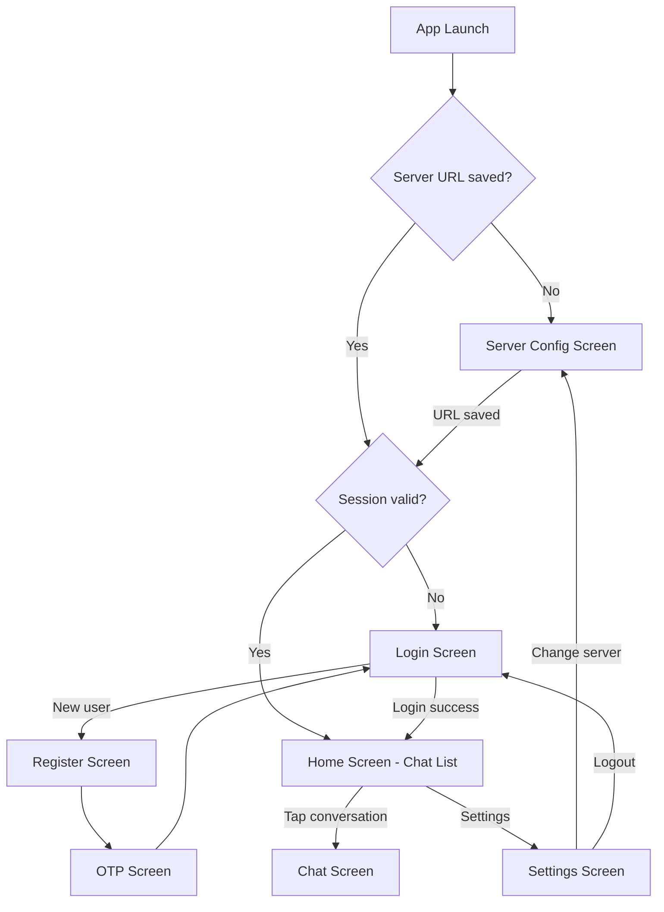

# Messenger Flutter Mobile App — Implementation Plan

## Why Flutter (Not React Native)

| Criteria | Flutter ✅ | React Native |
|---|---|---|
| **Performance** | Compiles to native ARM — silky smooth for real-time chat | JS bridge adds latency |
| **Language familiarity** | Dart is very similar to Java (you'll feel at home) | JavaScript/TypeScript |
| **Chat UI widgets** | Rich built-in Material widgets, `ListView.builder` is perfect for chat | Needs extra libraries |
| **WebSocket support** | First-class `stomp_dart_client` package | Works but more setup |
| **Animations** | Best-in-class animation framework | Requires extra libraries |
| **Single codebase** | Android + iOS + Web + Desktop | Android + iOS only |

---

## Backend API Summary (What the App Will Connect To)

Based on my analysis of your Spring Boot backend:

| Endpoint | Method | Auth | Purpose |
|---|---|---|---|
| `/api/v1/register` | POST (JSON body) | Public | Register new user |
| `/api/v1/verifyOtp` | POST (JSON body) | Public | Verify OTP |
| `/api/v1/login` | POST (form params) | Public | Login → returns session cookie |
| `ws://host/api/ws` | WebSocket STOMP | Session cookie | Real-time messaging |

**Auth model**: Your backend uses **HTTP session cookies** (`JSESSIONID`). The Flutter app will store and send this cookie with every request.

---

## Dynamic IP / Server URL Solution

> [!IMPORTANT]
> Since your PC's IP changes, the app needs a way to configure the server URL at runtime.

### Approach: **Server Configuration Screen** (with auto-discovery bonus)

1. **On first launch** → Show a "Connect to Server" screen where the user enters the server URL (e.g., `http://192.168.1.5:8080` or an ngrok URL like `https://abc123.ngrok.io`)
2. **Saved in local storage** → URL is persisted using `SharedPreferences`, so the user only enters it once
3. **Accessible from Settings** → User can change the URL anytime from the Settings screen
4. **Connection test** → A "Test Connection" button pings the server before saving
5. **QR Code scan option** → (Future enhancement) Your backend could display a QR code with the server URL; the app scans it — zero typing needed

This is the same pattern used by apps like **Jellyfin**, **Plex**, and **Home Assistant** — proven and user-friendly.

---

## Proposed Changes

### Project Structure

The Flutter app will be created at: `c:\Users\Ankit\IdeaProjects\Messenger\messenger_app\`

```
messenger_app/
├── lib/
│   ├── main.dart                          # App entry point
│   ├── app.dart                           # MaterialApp with theme & routing
│   │
│   ├── config/
│   │   ├── app_theme.dart                 # Premium dark/light theme
│   │   ├── app_routes.dart                # Named route definitions
│   │   └── api_constants.dart             # API path constants
│   │
│   ├── models/                            # Data models (mirror backend DTOs)
│   │   ├── user.dart                      # User model
│   │   ├── chat_message.dart              # ChatMessageDto equivalent
│   │   ├── api_response.dart              # Generic ApiResponse wrapper
│   │   └── enums.dart                     # MessageType, MediaType, Reactions
│   │
│   ├── services/                          # Business logic layer
│   │   ├── api_service.dart               # HTTP client (REST calls)
│   │   ├── auth_service.dart              # Login, register, session management
│   │   ├── chat_service.dart              # WebSocket STOMP connection
│   │   ├── storage_service.dart           # SharedPreferences wrapper
│   │   └── server_config_service.dart     # Server URL management
│   │
│   ├── providers/                         # State management (Provider/ChangeNotifier)
│   │   ├── auth_provider.dart             # Auth state
│   │   ├── chat_provider.dart             # Messages & conversations state
│   │   ├── server_config_provider.dart    # Server URL state
│   │   └── presence_provider.dart         # Online/offline tracking
│   │
│   ├── screens/                           # UI Screens
│   │   ├── server_config/
│   │   │   └── server_config_screen.dart  # Enter/change server URL
│   │   ├── auth/
│   │   │   ├── login_screen.dart          # Phone + password login
│   │   │   ├── register_screen.dart       # Registration form
│   │   │   └── otp_screen.dart            # OTP verification
│   │   ├── home/
│   │   │   └── home_screen.dart           # Chat list (conversations)
│   │   ├── chat/
│   │   │   └── chat_screen.dart           # Individual chat view
│   │   └── settings/
│   │       └── settings_screen.dart       # App settings (server URL, profile, logout)
│   │
│   └── widgets/                           # Reusable UI components
│       ├── chat_bubble.dart               # Message bubble (sent/received)
│       ├── conversation_tile.dart         # Chat list item
│       ├── online_indicator.dart          # Green dot for online status
│       ├── message_input.dart             # Text field + send button
│       └── loading_overlay.dart           # Full-screen loading indicator
│
├── pubspec.yaml                           # Dependencies
└── assets/                                # App icons, images
```

---

### Phase 1: Project Setup & Core Infrastructure

#### [NEW] `pubspec.yaml`
Key dependencies:
- `provider` — State management (lightweight, official)
- `http` — REST API calls
- `stomp_dart_client` — STOMP over WebSocket
- `shared_preferences` — Local storage for server URL & session
- `google_fonts` — Premium typography (Inter/Outfit)
- `flutter_animate` — Micro-animations
- `intl` — Date/time formatting

#### [NEW] `lib/config/app_theme.dart`
Premium dark theme with:
- Deep dark background (`#0A0A0F`) with glassmorphism cards
- Vibrant accent gradient (indigo → cyan)
- Google Fonts (Inter for body, Outfit for headings)
- Smooth transitions and elevation effects

#### [NEW] `lib/config/api_constants.dart`
All API paths as constants matching your backend:
- `/api/v1/register`, `/api/v1/verifyOtp`, `/api/v1/login`
- WebSocket endpoint: `/api/ws`
- STOMP destinations: `/app/chat.private`, `/user/queue/messages`, `/topic/presence`

#### [NEW] `lib/models/` (all model files)
Dart data classes mirroring your backend DTOs with JSON serialization:
- `User` ← `UserResponseDto`
- `ChatMessage` ← `ChatMessageDto`
- `ApiResponse<T>` ← `ApiResponse<T>`
- Enums: `MessageType`, `MediaType`, `Reactions`

---

### Phase 2: Server Configuration & Networking

#### [NEW] `lib/services/server_config_service.dart`
- Stores/loads server URL from `SharedPreferences`
- `testConnection(url)` → pings `GET /api/actuator/health` to verify server is reachable
- Validates URL format

#### [NEW] `lib/services/api_service.dart`
- Central HTTP client using `http` package
- Reads base URL from `ServerConfigService`
- Automatically attaches `JSESSIONID` cookie to all requests
- Handles `ApiResponse` parsing and error mapping

#### [NEW] `lib/screens/server_config/server_config_screen.dart`
Beautiful server URL entry screen with:
- URL text field with protocol prefix hint
- "Test Connection" button with animated status indicator
- Recent/saved server URLs
- Shown on first launch or when server is unreachable

---

### Phase 3: Authentication Flow

#### [NEW] `lib/services/auth_service.dart`
- `register(username, firstName, lastName, mobNumber, email, password)`
- `verifyOtp(identifier, otp)`
- `login(mobNumber, password, deviceInfo)` → stores session cookie
- Auto-populates device info (model, OS, device ID)

#### [NEW] `lib/screens/auth/register_screen.dart`
Registration form with:
- Fields: username, first name, last name, phone, email, password
- Validation matching backend constraints
- Animated transitions between steps

#### [NEW] `lib/screens/auth/otp_screen.dart`
OTP verification with:
- 6-digit pin code input fields
- Auto-focus progression
- Resend OTP timer
- Supports both phone and email OTP

#### [NEW] `lib/screens/auth/login_screen.dart`
Login screen with:
- Phone number + password fields
- "Remember me" toggle
- Link to register screen
- Error handling with snackbar feedback

---

### Phase 4: Real-Time Chat

#### [NEW] `lib/services/chat_service.dart`
STOMP WebSocket client:
- Connect to `ws://<server>/api/ws` with session cookie
- Subscribe to `/user/queue/messages` for incoming messages
- Subscribe to `/user/queue/errors` for error notifications
- Subscribe to `/topic/presence` for online/offline events
- Send messages via `/app/chat.private` with `senderPhone`/`receiverPhone` headers
- Auto-reconnect on disconnect with exponential backoff

#### [NEW] `lib/screens/home/home_screen.dart`
Conversation list:
- List of recent chats with last message preview
- Online/offline indicator per contact
- Search bar for filtering conversations
- FAB to start new chat
- Pull-to-refresh

#### [NEW] `lib/screens/chat/chat_screen.dart`
Individual chat view:
- Message list with sent/received bubbles (different colors/alignment)
- Timestamp grouping (Today, Yesterday, dates)
- Message input bar with send button
- Online status of the other person in app bar
- Auto-scroll to latest message

#### [NEW] `lib/widgets/chat_bubble.dart`
WhatsApp-style message bubble:
- Sender bubble (right, accent gradient)
- Receiver bubble (left, dark surface)
- Timestamp, read/delivered ticks
- Rounded corners with tail

---

### Phase 5: Settings & Polish

#### [NEW] `lib/screens/settings/settings_screen.dart`
Settings screen with:
- **Server URL** — tap to change (navigates to server config screen)
- **Profile info** — name, phone, email (read-only for now)
- **Logout** — clears session and navigates to login
- **App version**

---

## App Flow Diagram



---

## User Review Required

> [!IMPORTANT]
> **Where to create the Flutter project?**
> I plan to create it at `c:\Users\Ankit\IdeaProjects\Messenger\messenger_app\`. This keeps it inside your existing project. Let me know if you'd prefer a different location.

> [!WARNING]
> **Flutter SDK required.**
> You need Flutter SDK installed on your PC to build and run the app. If you don't have it yet, I'll help you install it first. Do you have Flutter installed?

> [!IMPORTANT]
> **Your backend uses session-based auth (cookies).**
> This works fine for now, but for a production mobile app, **JWT token-based auth** is much more reliable (cookies can expire, don't work well with mobile background states). For Phase 1, I'll work with your current session-based auth. We can migrate to JWT later.

## Open Questions

1. **Do you have Flutter SDK installed?** If not, I'll guide you through the installation first.
2. **App name preference?** Should I keep it as "Messenger" or do you have a brand name in mind?
3. **Color preference?** I'm planning a premium dark theme with indigo-cyan gradients. Any preference for different colors?

---

## Verification Plan

### Automated Tests
- `flutter test` — Unit tests for services and models
- `flutter analyze` — Static analysis for code quality

### Manual Verification
1. Run the Spring Boot backend on your PC
2. Run `flutter run` on a connected Android device or emulator
3. Enter your PC's local IP as the server URL
4. Test full flow: Register → OTP → Login → Send/Receive messages between two devices
